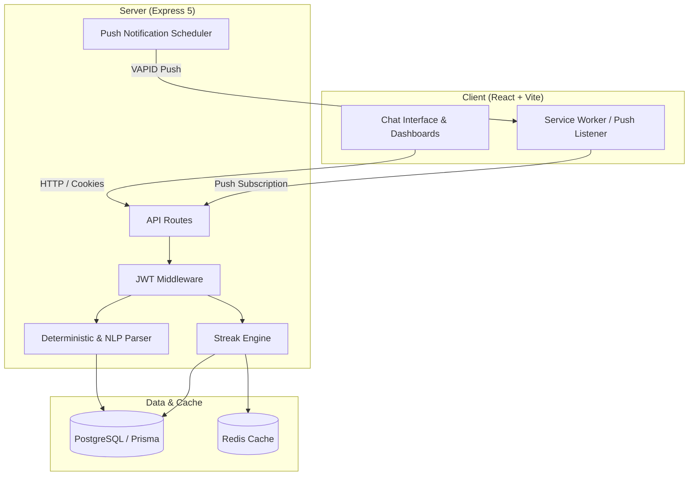

# ExpenseTrack

ExpenseTrack is a full-stack, chat-based personal expense and financial habit tracking application. Instead of manual spreadsheet or multi-step form entry, users log expenses through natural language text (e.g., "Coffee 150", "Uber 300", or "No spend today"). The system parses the intent and details, persists the records, maintains daily logging streaks via Redis, and generates weekly spending insights.

---

## Technical Stack

| Layer | Technologies |
|---|---|
| Frontend | React 19, Vite, Tailwind CSS v4, PWA Service Worker |
| Backend | Node.js, Express 5, Prisma ORM |
| Database | PostgreSQL |
| Cache & Session Store | Redis |
| Testing | Jest, Supertest, Cypress |
| Notifications | Web Push API, VAPID, node-cron |

---

## Architecture Overview



---

## Core Capabilities

- **Natural Language Parsing**: Hybrid parsing module combining regex/dictionary rules with fallback processing to extract amounts, categories, and dates from conversational text.
- **Streak & Habit Engine**: Daily consistency tracking backed by Redis with automatic streak freeze management and database persistence.
- **Weekly Spending Insights**: Automated aggregation of expenditure trends, top categories, and saving habits across customizable periods.
- **Web Push Notifications**: Background service worker support and scheduled streak reminders delivered at configurable intervals.
- **Guest and Authenticated Workflows**: Frictionless anonymous onboarding via signed HTTP-only JWTs with seamless transition to registered accounts.
- **Privacy Controls**: Integrated client-side amount masking for viewing financial logs in public environments.

---

## Repository Structure

```
ExpenseTrack/
├── client/                      # Frontend application
│   ├── cypress/                 # End-to-end test suites
│   ├── public/                  # Static assets and Service Worker (sw.js)
│   ├── src/
│   │   ├── components/          # React UI components (Chat, History, Insights, Settings)
│   │   ├── context/             # Global React state providers
│   │   ├── utils/               # API clients, date utilities, and notification helpers
│   │   ├── App.jsx              # Main application shell
│   │   └── index.css            # Base styles and Tailwind imports
│   ├── tailwind.config.js       # Tailwind CSS configuration
│   └── vite.config.js           # Vite build configuration
│
├── server/                      # Backend API service
│   ├── prisma/
│   │   ├── schema.prisma        # Prisma schema definitions
│   │   └── seed.js              # Database seed script for development
│   ├── scripts/                 # Development runners and maintenance utilities
│   ├── src/
│   │   ├── controllers/         # Request handlers
│   │   ├── middlewares/         # Authentication, rate limiting, and error handlers
│   │   ├── parser/              # Parsing pipeline and merchant matchers
│   │   ├── repositories/        # Database access layer
│   │   ├── scheduler/           # Background cron jobs for push notifications
│   │   ├── services/            # Core business logic
│   │   ├── streak-engine/       # Redis-backed streak management
│   │   ├── utils/               # Structured logging and helper utilities
│   │   ├── app.js               # Express application configuration
│   │   └── server.js            # Server entrypoint
│   └── tests/                   # Jest unit and integration tests
│
└── Plan/                        # Planning, API contracts, and design specifications
```

---

## Getting Started

### Prerequisites

- Node.js (v18.x or later)
- PostgreSQL (v14 or later)
- Redis (v6 or later, or running via Docker)

---

### Local Setup

1. **Clone the repository:**
   ```bash
   git clone https://github.com/AndyAndroid007/ExpenseTracker.git
   cd ExpenseTracker
   ```

2. **Configure environment variables:**
   
   Copy `.env.example` to `.env` in the `server` directory:
   ```bash
   cp server/.env.example server/.env
   ```
   
   Configure the following parameters in `server/.env`:
   - `DATABASE_URL`: PostgreSQL connection string.
   - `JWT_SECRET`: Secret used for signing JWT auth tokens.
   - `NODE_ENV`: Set to `development`.
   - `REDIS_URL`: Redis connection URL (default: `redis://localhost:6379`).
   - `CLIENT_URL`: URL of the frontend client (default: `http://localhost:5173`).
   - `GEMINI_API_KEY`: *(Optional)* API key for AI fallback parsing.
   - `VAPID_PUBLIC_KEY` / `VAPID_PRIVATE_KEY`: *(Optional)* VAPID credentials for web push notifications.

3. **Install dependencies:**
   ```bash
   # Install server dependencies
   cd server
   npm install

   # Install client dependencies
   cd ../client
   npm install
   ```

4. **Initialize the database:**
   ```bash
   cd ../server

   # Push schema migrations to PostgreSQL
   npx prisma db push

   # Generate Prisma client bindings
   npx prisma generate

   # Populate initial categories and sample demo data
   npm run seed
   ```

5. **Start development servers:**

   You can run both client and server manually:

   * **Backend:**
     ```bash
     cd server
     npm run dev
     # API runs on http://localhost:8080 (Health check: http://localhost:8080/health)
     ```

   * **Frontend:**
     ```bash
     cd client
     npm run dev
     # Application runs on http://localhost:5173
     ```

---

## Test Execution

### Backend Tests (Jest)
Run unit and integration test suites:
```bash
cd server
npm test
```

### Frontend Tests (Cypress)
Run end-to-end user journey tests:
```bash
cd client
npx cypress run
```

---

## NPM Scripts Reference

### Server (`server/package.json`)
- `npm run dev`: Starts the API server with nodemon reload.
- `npm run seed`: Executes the database seed script (`prisma/seed.js`).
- `npm test`: Runs the Jest backend test suite.
- `npm run db:reset`: Resets the test database schema.
- `npm run db:cleanup-guests`: Cleans up expired guest user sessions.

### Client (`client/package.json`)
- `npm run dev`: Starts the Vite local development server.
- `npm run build`: Compiles production assets into `client/dist`.
- `npm run lint`: Runs ESLint checks across the frontend codebase.
- `npm run preview`: Locally previews the production build.
